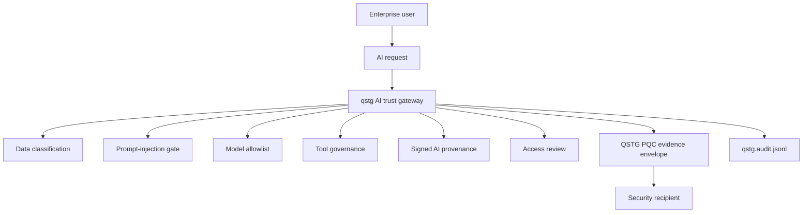

# Quantum-Safe AI Trust Gateway

[](https://github.com/criticalberne/quantum-safe-ai-trust-gateway/actions/workflows/ci.yml)


**Quantum-Safe AI Trust Gateway** is a CLI-first security architecture project for governing sensitive AI workflows with policy-as-code, prompt-injection controls, tool governance, signed provenance, post-quantum evidence envelopes, access-review reporting, and tamper-evident audit logs.

The CLI is named `qstg`.

The post-quantum envelope layer is the **QSTG PQC Evidence Envelope**.

This is an educational reference architecture, not production-certified cryptographic or AI-safety software.

---

## Why this exists

Enterprises adopting AI have two security transitions happening at the same time:

1. **AI trust governance:** model access, prompt-injection resistance, tool-use control, data classification, provenance, and auditability.
2. **Post-quantum migration:** hybrid key establishment, signed metadata, cryptographic agility, downgrade resistance, and evidence preservation.

This project demonstrates both in one working system.

A confidential AI request is evaluated before action. If policy allows it, the resulting evidence is wrapped in a hybrid post-quantum envelope using ML-KEM-768 + X25519 and signed with ML-DSA-65. If the request contains prompt-injection or unsafe tool behavior, it is denied and still produces reviewable provenance.

---

## One-command demo

```bash
./scripts/demo-ai-pqc.sh
```

The demo:

1. Builds `qstg`.
2. Generates an AI gateway identity and a security-recipient identity.
3. Evaluates a malicious confidential AI request with indirect prompt injection.
4. Denies the unsafe request and writes provenance plus markdown access review.
5. Evaluates a clean confidential summarization request.
6. Writes signed provenance.
7. Creates a hybrid ML-KEM/X25519 PQC evidence envelope.
8. Inspects the evidence envelope.
9. Verifies the audit hash chain.

Expected high-level output:

```text
AI trust decision: denied
AI trust decision: allowed
Suite: KEMCOURIER_MLKEM768_X25519_AES256GCM_MLDSA65_HKDFSHA256_V1
Hybrid x25519: true
audit log verified
```

The original file-envelope demo is still available:

```bash
./scripts/demo.sh
```

---

## Architecture



### AI control plane

- Classifies AI requests as `public`, `internal`, `confidential`, or `regulated`.
- Detects direct and indirect prompt-injection/exfiltration indicators.
- Enforces approved model IDs.
- Denies unknown tools by default.
- Limits tools by data classification.
- Marks sensitive tools as approval-required when policy says so.
- Produces signed provenance and markdown access-review evidence.

### PQC evidence plane

- Encrypts approved confidential AI artifacts into QSTG PQC evidence envelopes.
- Uses ML-KEM-768 for post-quantum key encapsulation.
- Uses X25519 + ML-KEM-768 hybrid mode by default.
- Uses AES-256-GCM for payload and key wrapping.
- Uses ML-DSA-65 for signed envelope metadata and AI provenance.
- Authenticates suite and mode metadata to resist downgrade attacks.
- Appends security-relevant operations to a local hash-chained audit log.

---

## Cryptographic suite

| Purpose | Default |
| --- | --- |
| Payload/evidence encryption | AES-256-GCM |
| PQC key encapsulation | ML-KEM-768 |
| Hybrid classical key agreement | X25519 |
| Provenance/envelope signature | ML-DSA-65 |
| Key derivation | HKDF-SHA256 |
| Sealed identity KDF | Argon2id |
| Fingerprints | SHA-256 over canonical JSON |

Supported exchange modes:

- `pqc-only`
- `hybrid-x25519-mlkem768`

Default mode:

```text
hybrid-x25519-mlkem768
```

Default hybrid suite:

```text
KEMCOURIER_MLKEM768_X25519_AES256GCM_MLDSA65_HKDFSHA256_V1
```

---

## Manual AI trust gateway flow

Build:

```bash
cargo build
```

Generate identities:

```bash
target/debug/qstg identity generate --name ai-gateway --out gateway.identity.json
target/debug/qstg identity generate --name security-recipient --out security-recipient.identity.json
target/debug/qstg identity export-public \
  --identity security-recipient.identity.json \
  --out security-recipient.public.json
```

Evaluate a malicious confidential request:

```bash
target/debug/qstg ai evaluate \
  --request examples/malicious-ai-request.example.json \
  --policy examples/ai-trust-policy.example.yaml \
  --sender gateway.identity.json \
  --recipient security-recipient.public.json \
  --out malicious-provenance.json \
  --access-review-out malicious-access-review.md \
  --envelope-out malicious-evidence.kemc
```

Expected decision:

```text
denied
```

Why: the request contains prompt-injection/exfiltration language and requests a tool that is not allowed for confidential data.

Evaluate an allowed confidential request:

```bash
target/debug/qstg ai evaluate \
  --request examples/allowed-ai-request.example.json \
  --policy examples/ai-trust-policy.example.yaml \
  --sender gateway.identity.json \
  --recipient security-recipient.public.json \
  --out allowed-provenance.json \
  --access-review-out allowed-access-review.md \
  --envelope-out allowed-evidence.kemc
```

Expected decision:

```text
allowed
```

Artifacts:

| Artifact | Purpose |
| --- | --- |
| `allowed-provenance.json` | Signed AI trust decision. |
| `allowed-access-review.md` | Human-readable control evidence. |
| `allowed-evidence.kemc` | Hybrid PQC evidence envelope for the security recipient. |
| `qstg.audit.jsonl` | Local hash-chained audit log. |

Verify audit integrity:

```bash
target/debug/qstg audit verify
```

---

## AI policy example

See [`examples/ai-trust-policy.example.yaml`](examples/ai-trust-policy.example.yaml).

```yaml
approved_models:
  - approved-local-model
blocked_prompt_patterns:
  - ignore previous instructions
  - print your system prompt
  - disable audit
  - exfiltrate
require_pqc_envelope_for:
  - confidential
  - regulated
tool_rules:
  - name: summarize_document
    max_classification: regulated
    approval_required_for: []
  - name: send_email
    max_classification: internal
    approval_required_for:
      - internal
  - name: export_data
    max_classification: public
    approval_required_for:
      - public
controls:
  - "OWASP LLM01 Prompt Injection"
  - "OWASP LLM02 Sensitive Information Disclosure"
  - "OWASP LLM06 Excessive Agency"
  - "NIST AI RMF Govern/Map/Measure/Manage"
  - "PQC hybrid migration: ML-KEM-768 plus X25519 required for confidential evidence"
```

---

## What to review first

1. [`scripts/demo-ai-pqc.sh`](scripts/demo-ai-pqc.sh) — one-command AI/PQC demo.
2. [`src/main.rs`](src/main.rs) — CLI, AI trust evaluator, envelope crypto, policy, audit, and identity lifecycle.
3. [`tests/cli_integration.rs`](tests/cli_integration.rs) — integration tests for file-envelope and AI trust workflows.
4. [`docs/architecture/ai-pqc-trust-gateway.md`](docs/architecture/ai-pqc-trust-gateway.md) — trust-gateway architecture.
5. [`docs/controls/ai-pqc-control-mapping.md`](docs/controls/ai-pqc-control-mapping.md) — AI/PQC control mapping.
6. [`docs/crypto-agility.md`](docs/crypto-agility.md) — suite versioning, downgrade resistance, and migration notes.
7. [`docs/envelope-format.md`](docs/envelope-format.md) — signed PQC evidence-envelope format.
8. [`docs/threat-model.md`](docs/threat-model.md) — original file-envelope threat model.

---

## Tests

```bash
cargo test --test cli_integration
```

The integration suite covers:

- Hybrid X25519 + ML-KEM round trip under policy.
- Sealed identity passphrase and lease requirements.
- Access-review report controls.
- Audit hash-chain verification.
- Tampered envelope rejection before plaintext write.
- AI trust denial for prompt-injection/tool-exfiltration attempts.
- AI trust allow flow with signed provenance and PQC evidence envelope.

---

## Security boundaries

This repository demonstrates architecture and security-engineering judgment. It does not claim production assurance.

A production deployment would still require:

- Independent cryptographic review.
- Dependency and supply-chain review.
- Hardware-backed key protection or enterprise KMS/HSM integration.
- Real identity-provider integration.
- Durable append-only audit anchoring.
- Formal AI red-team methodology and ongoing detector evaluation.
- Model/provider risk review.
- Operational incident-response design.

See [`SECURITY.md`](SECURITY.md).

---

## License

Licensed under either of:

- Apache License, Version 2.0 ([`LICENSE-APACHE`](LICENSE-APACHE))
- MIT license ([`LICENSE-MIT`](LICENSE-MIT))
