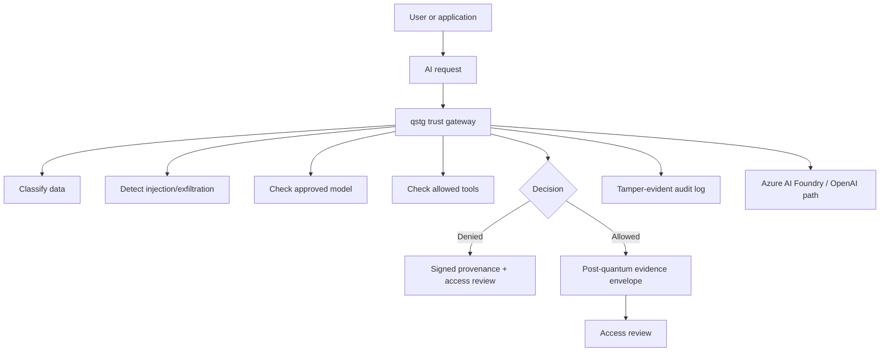

# Quantum-Safe AI Trust Gateway

[](https://github.com/criticalberne/quantum-safe-ai-trust-gateway/actions/workflows/ci.yml)


**Quantum-Safe AI Trust Gateway** is a working security architecture prototype for two board-level technology risks: unsafe enterprise AI adoption and post-quantum cryptographic migration.

The project shows how sensitive AI requests can be governed before model execution, how unsafe AI actions can be denied with evidence, and how approved confidential AI artifacts can be wrapped in post-quantum protected evidence envelopes for future review.

The CLI is named `qstg`.

This is an educational reference architecture, not production-certified cryptographic or AI-safety software.

---

## Leadership brief

Organizations are moving sensitive work into AI systems while also preparing for a future where current public-key cryptography must be replaced or augmented. Those two transitions usually get treated separately. This project connects them.

qstg demonstrates a practical control pattern:

1. **Check the AI request before action.** Classify the data, detect prompt-injection attempts, verify the model is approved, and restrict what tools the AI can use.
2. **Produce evidence either way.** Denied requests generate reviewable provenance. Approved confidential requests generate signed provenance and a protected evidence package.
3. **Use crypto that can survive migration pressure.** Confidential AI evidence is wrapped with a hybrid post-quantum design using ML-KEM-768 plus X25519 and signed with ML-DSA-65.
4. **Make the decision auditable.** The project produces access reviews, fingerprints, signed metadata, and a local tamper-evident audit chain.
5. **Fit the enterprise stack.** The Azure path maps to Azure AI Foundry / Azure OpenAI, managed identity, Key Vault, Azure Monitor, private endpoints, and optional HashiCorp Vault-style custody.

This is not a chatbot. It is a security control plane for deciding whether an AI workflow should run, what evidence must be created, and how that evidence is protected.

---

## What leadership should notice

| Concern | What qstg demonstrates |
| --- | --- |
| Sensitive data going into AI | Requests are classified before model execution. Confidential and regulated requests receive stricter controls. |
| Prompt injection and data exfiltration | Malicious instructions are detected and denied before model/tool execution. |
| AI tools acting too freely | Tools are allowlisted, classification-limited, and can require approval. Unknown tools fail closed. |
| Lack of accountability | Every decision produces provenance and a human-readable access review. |
| Future quantum risk | Confidential AI evidence is protected with a hybrid post-quantum envelope. |
| Audit and investigation | Decisions, fingerprints, and envelope metadata are preserved in a tamper-evident audit trail. |
| Cloud adoption | Azure AI Foundry / Azure OpenAI, Key Vault, managed identity, Monitor, and private-link deployment patterns are documented and validated. |

---

## Five-minute demo path

Run:

```bash
./scripts/demo-ai-pqc.sh
```

The demo shows two AI requests:

### 1. Unsafe request

A confidential request contains hidden instructions such as “ignore previous instructions,” disable audit logging, and send data away.

qstg denies it.

Expected signal:

```text
AI trust decision: denied
```

The denial still produces provenance and an access review explaining why the request was blocked.

### 2. Allowed request

A clean confidential summarization request uses an approved model and allowed tool behavior.

qstg allows it, signs the decision, creates a hybrid post-quantum evidence envelope, and verifies the audit chain.

Expected signal:

```text
AI trust decision: allowed
Suite: KEMCOURIER_MLKEM768_X25519_AES256GCM_MLDSA65_HKDFSHA256_V1
Hybrid x25519: true
audit log verified
```

This proves the control pattern end to end: deny unsafe AI, allow governed AI, preserve evidence, protect confidential output, and verify audit integrity.

---

## Architecture in one picture



---

## Azure-ready path

qstg includes an Azure integration path for organizations using Azure AI Foundry and Azure OpenAI.

It supports an Azure policy shape for:

- Azure OpenAI deployment identifiers.
- Microsoft Entra ID / managed identity.
- Azure Key Vault custody for sealed qstg identity and active policy.
- Azure Monitor / Sentinel-ready audit export.
- Private endpoint / Private Link hardening.
- Optional HashiCorp Vault-style secret-provider configuration.

Validate the Azure example policy:

```bash
target/debug/qstg config validate \
  --policy examples/azure/azure-ai-foundry-policy.example.yaml
```

Render an Azure deployment plan:

```bash
target/debug/qstg azure plan \
  --policy examples/azure/azure-ai-foundry-policy.example.yaml \
  --out azure-plan.md
```

Azure reference files:

- [`examples/azure/azure-ai-foundry-policy.example.yaml`](examples/azure/azure-ai-foundry-policy.example.yaml)
- [`examples/azure/allowed-foundry-request.example.json`](examples/azure/allowed-foundry-request.example.json)
- [`docs/azure/azure-reference-architecture.md`](docs/azure/azure-reference-architecture.md)
- [`docs/azure/deployment-hardening.md`](docs/azure/deployment-hardening.md)
- [`infra/azure/main.bicep`](infra/azure/main.bicep)

---

## What the project actually builds

| Capability | Status |
| --- | --- |
| Local AI request evaluator | Implemented |
| Prompt-injection / exfiltration gate | Implemented |
| Model allowlist | Implemented |
| Tool governance | Implemented |
| Data classification | Implemented |
| Signed AI provenance | Implemented |
| Markdown access review | Implemented |
| Hybrid ML-KEM/X25519 evidence envelope | Implemented |
| ML-DSA signed envelope metadata | Implemented |
| Local tamper-evident audit chain | Implemented |
| Azure policy validation | Implemented |
| Azure deployment-plan renderer | Implemented |
| Azure Bicep support-resource scaffold | Implemented |
| Live Azure OpenAI SDK calls | Not yet implemented |
| Live Key Vault SDK adapter | Not yet implemented |
| Production certification | Not claimed |

---

## Technical quick start

Build:

```bash
cargo build
```

Generate identities:

```bash
target/debug/qstg identity generate --name ai-gateway --out gateway.identity.json
target/debug/qstg identity generate --name security-recipient --out security-recipient.identity.json
target/debug/qstg identity export-public \
  --identity security-recipient.identity.json \
  --out security-recipient.public.json
```

Evaluate a malicious confidential request:

```bash
target/debug/qstg ai evaluate \
  --request examples/malicious-ai-request.example.json \
  --policy examples/ai-trust-policy.example.yaml \
  --sender gateway.identity.json \
  --recipient security-recipient.public.json \
  --out malicious-provenance.json \
  --access-review-out malicious-access-review.md \
  --envelope-out malicious-evidence.kemc
```

Expected decision:

```text
denied
```

Evaluate an allowed confidential request:

```bash
target/debug/qstg ai evaluate \
  --request examples/allowed-ai-request.example.json \
  --policy examples/ai-trust-policy.example.yaml \
  --sender gateway.identity.json \
  --recipient security-recipient.public.json \
  --out allowed-provenance.json \
  --access-review-out allowed-access-review.md \
  --envelope-out allowed-evidence.kemc
```

Expected artifacts:

| Artifact | Purpose |
| --- | --- |
| `allowed-provenance.json` | Signed AI trust decision. |
| `allowed-access-review.md` | Human-readable control evidence. |
| `allowed-evidence.kemc` | Hybrid post-quantum evidence envelope. |
| `qstg.audit.jsonl` | Local hash-chained audit log. |

Verify audit integrity:

```bash
target/debug/qstg audit verify
```

---

## Cryptographic suite

| Purpose | Default |
| --- | --- |
| Payload/evidence encryption | AES-256-GCM |
| PQC key encapsulation | ML-KEM-768 |
| Hybrid classical key agreement | X25519 |
| Provenance/envelope signature | ML-DSA-65 |
| Key derivation | HKDF-SHA256 |
| Sealed identity KDF | Argon2id |
| Fingerprints | SHA-256 over canonical JSON |

Default hybrid suite:

```text
KEMCOURIER_MLKEM768_X25519_AES256GCM_MLDSA65_HKDFSHA256_V1
```

Supported exchange modes:

- `pqc-only`
- `hybrid-x25519-mlkem768`

Default mode:

```text
hybrid-x25519-mlkem768
```

---

## What to review first

For the fastest review:

1. [`scripts/demo-ai-pqc.sh`](scripts/demo-ai-pqc.sh) — one-command AI/PQC demo.
2. [`README.md`](README.md) — project narrative and demo path.
3. [`docs/azure/azure-reference-architecture.md`](docs/azure/azure-reference-architecture.md) — Azure AI Foundry/OpenAI integration architecture.
4. [`docs/azure/deployment-hardening.md`](docs/azure/deployment-hardening.md) — Azure deployment hardening checklist.
5. [`docs/controls/ai-pqc-control-mapping.md`](docs/controls/ai-pqc-control-mapping.md) — AI/PQC control mapping.
6. [`src/main.rs`](src/main.rs) — working implementation.
7. [`tests/cli_integration.rs`](tests/cli_integration.rs) — behavior-driven integration tests.
8. [`infra/azure/main.bicep`](infra/azure/main.bicep) — Azure support-resource scaffold.

---

## Tests

```bash
cargo test --test cli_integration
```

The integration suite covers:

- Hybrid X25519 + ML-KEM round trip under policy.
- Sealed identity passphrase and lease requirements.
- Access-review report controls.
- Audit hash-chain verification.
- Tampered envelope rejection before plaintext write.
- AI trust denial for prompt-injection/tool-exfiltration attempts.
- AI trust allow flow with signed provenance and PQC evidence envelope.
- Azure policy validation and Azure deployment-plan rendering.

---

## Security boundaries

This project demonstrates architecture and security-engineering judgment. It does not claim production assurance.

A production deployment would still require:

- Independent cryptographic review.
- Dependency and supply-chain review.
- Hardware-backed key protection or enterprise KMS/HSM integration.
- Real identity-provider integration.
- Durable append-only audit anchoring.
- Formal AI red-team methodology and ongoing detector evaluation.
- Model/provider risk review.
- Operational incident-response design.
- Live Azure SDK adapters and cloud-environment tests.

See [`SECURITY.md`](SECURITY.md).

---

## License

Licensed under either of:

- Apache License, Version 2.0 ([`LICENSE-APACHE`](LICENSE-APACHE))
- MIT license ([`LICENSE-MIT`](LICENSE-MIT))
