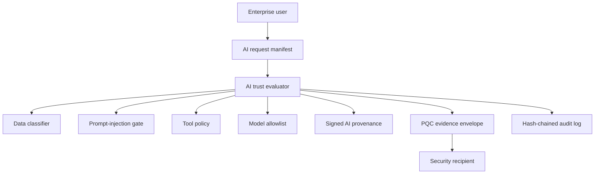

# Quantum-Safe AI Trust Gateway Architecture

## Purpose

The Quantum-Safe AI Trust Gateway demonstrates how an enterprise can govern sensitive AI workflows while preparing for post-quantum cryptographic migration.

It combines two trust planes:

1. **AI control plane** — classifies requests, detects prompt-injection indicators, authorizes models and tools, records policy decisions, and produces human-readable access reviews.
2. **PQC evidence plane** — encrypts approved confidential AI artifacts with ML-KEM-768/X25519 hybrid envelopes, signs metadata with ML-DSA-65, and writes tamper-evident audit events.

## Trust boundaries

## Request lifecycle

1. The caller submits an AI request containing actor, model, prompt, optional context, requested tools, and optional declared data classification.
2. The gateway classifies the request as `public`, `internal`, `confidential`, or `regulated`.
3. The prompt and context are scanned for deterministic prompt-injection and exfiltration indicators.
4. The requested model is checked against the policy allowlist.
5. Each requested tool is checked against allowlist, maximum data classification, and human-approval thresholds.
6. The gateway emits a decision: `allowed`, `approval-required`, or `denied`.
7. The decision is written as signed AI provenance when a signer identity is supplied.
8. If policy requires PQC evidence for the data classification and the decision is allowed, the gateway writes a hybrid ML-KEM/X25519 evidence envelope for the security recipient.
9. AI and cryptographic operations append audit events to `qstg.audit.jsonl`.
10. The markdown access review explains the decision, controls, tools, data class, provenance signature, PQC suite, and envelope fingerprint.

## Security invariants

- Prompt-injection evidence denies the request before evidence envelope creation.
- Unknown tools are denied by default.
- Tools cannot process data above their maximum classification.
- Approval-required tools do not silently run as allowed.
- Confidential or regulated allowed requests require a PQC evidence envelope when policy says so.
- Evidence envelopes authenticate suite, mode, sender, recipient, wrapped key, payload, and KEM metadata.
- Hybrid evidence uses `KEMCOURIER_MLKEM768_X25519_AES256GCM_MLDSA65_HKDFSHA256_V1` by default.
- Signed provenance and audit events preserve reviewable evidence of model, actor, decision, reasons, controls, and envelope fingerprint.

## Deliberate prototype boundaries

This reference architecture intentionally does not include network LLM calls, a database, a web service, or vendor-specific APIs. The goal is to make security decisions deterministic and testable before integrating with any model provider.

A production implementation would add:

- OIDC/SAML identity.
- KMS/HSM-backed signing and decapsulation.
- SIEM export.
- Durable append-only audit anchoring.
- Human approval workflow.
- Real DLP/classification services.
- Continuous AI red-team evaluation.
- Model/provider inventory and drift detection.
