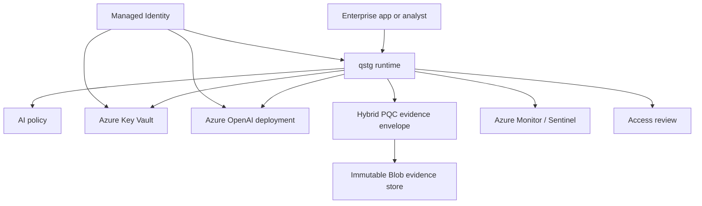

# Azure Reference Architecture

## Goal

This reference architecture makes qstg plug into Azure AI Foundry / Azure OpenAI while preserving qstg's core guarantees: policy-gated AI use, signed provenance, post-quantum evidence envelopes, and auditable security decisions.

The Azure path is Azure-native by default and portable by design:

- Azure AI Foundry / Azure OpenAI for approved model deployments.
- Microsoft Entra ID managed identity for runtime authentication.
- Azure Key Vault for sealed qstg identity and policy custody.
- Azure Monitor / Microsoft Sentinel-ready audit export.
- Private endpoints for model, vault, storage, and logging paths.
- Optional HashiCorp Vault policy shape for enterprises that already standardize on Vault.

## Logical architecture



## Request flow

1. A caller submits an AI request manifest to qstg.
2. qstg loads active policy and sealed identity material from Azure Key Vault or local fallback.
3. qstg classifies data and checks prompt-injection indicators.
4. qstg verifies the requested Azure OpenAI deployment is approved.
5. qstg evaluates tool policy before any model call.
6. Denied requests produce provenance and audit events without invoking Azure OpenAI.
7. Allowed requests invoke the approved Azure OpenAI deployment.
8. Confidential or regulated evidence is wrapped in a hybrid ML-KEM-768/X25519 PQC envelope.
9. qstg writes access-review evidence and emits audit events for Azure Monitor / Sentinel routing.

## Azure identity model

Use a user-assigned managed identity for the qstg runtime.

Recommended assignments:

| Principal | Scope | Role | Purpose |
| --- | --- | --- | --- |
| qstg runtime managed identity | Azure OpenAI resource | Cognitive Services OpenAI User | Inference-only model access. |
| qstg runtime managed identity | Azure Key Vault | Key Vault Secrets User | Read sealed identity and active policy. |
| qstg runtime managed identity | Storage evidence container | Storage Blob Data Contributor | Write PQC evidence envelopes. |
| qstg runtime managed identity | Log Analytics / Monitor path | Monitoring Metrics Publisher or workspace-specific ingestion role | Emit operational evidence. |
| security admin identity | Azure Key Vault | Key Vault Secrets Officer | Publish policy and rotate sealed qstg identity. |

Prefer managed identity over API keys. API-key mode should be treated as demo or exception-only.

## Secret custody

Azure Key Vault should hold:

- `qstg-gateway-identity-sealed` — sealed qstg gateway identity.
- `qstg-ai-policy-active` — active AI trust policy.
- `qstg-security-recipient-public` — public recipient bundle for evidence envelopes.
- provider endpoint/deployment config when not supplied by environment.

Do not assume Key Vault performs ML-KEM or ML-DSA operations. In this architecture, Key Vault is the Azure-native custody and configuration boundary for sealed qstg material. The qstg runtime performs PQC envelope operations after policy and lease checks.

## Network model

For sensitive deployments:

- Use private endpoints for Azure OpenAI / Foundry resources.
- Use private endpoint for Azure Key Vault.
- Use private endpoint for Storage evidence account.
- Use private DNS zones for private endpoint resolution.
- Disable public network access after private endpoint routing is validated.
- Restrict outbound egress from the qstg runtime to approved Azure service endpoints.

## Configuration validation

Validate an Azure policy before deployment:

```bash
qstg config validate \
  --policy examples/azure/azure-ai-foundry-policy.example.yaml
```

Render an Azure deployment plan:

```bash
qstg azure plan \
  --policy examples/azure/azure-ai-foundry-policy.example.yaml \
  --out azure-plan.md
```

## Production gaps

This repo does not yet perform live Azure SDK calls in CI. The Azure integration layer currently provides policy schema, validation, deployment planning, examples, and infrastructure scaffold. Live Azure OpenAI / Key Vault adapters should be added behind feature flags and tested with explicit manual smoke tests against a real subscription.
